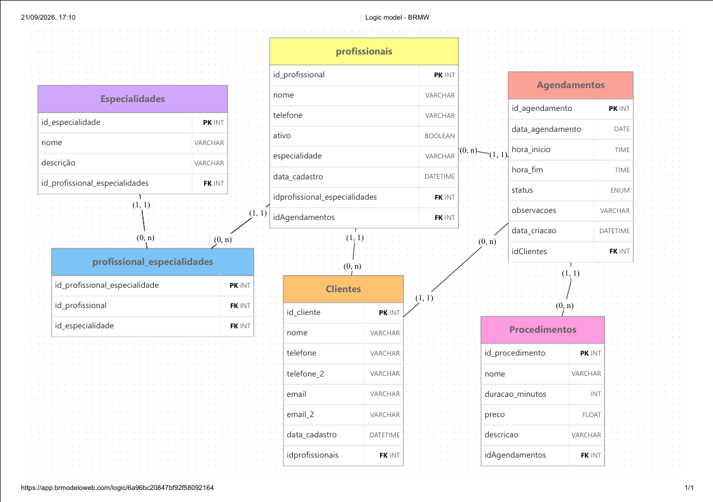

# Entrega 1 — Modelo Conceitual (DER)
### Modelagem de um sistema de gestão de informações para uma organização de pequeno porte

---

## Metadados

- **Nomes dos alunos e RGM**
  - Franciele Souza — RGM: _______________
  - Julia Parra — RGM: _______________
  - Emilly Rodriguez — RGM: _______________
  - Kamilly — RGM:__________

---

## 1. Caracterização da Organização

- **Nome e natureza da organização:** Salão dos Primos — salão de beleza (feminino e masculino), organização **com fins lucrativos**.
- **Contexto e porte:** Operação de pequeno porte, atualmente com **4 profissionais** atuando no salão e um público de **30 a 50 clientes** atendidos. O volume de atividade é composto principalmente por agendamentos e execução de procedimentos de beleza (corte, coloração, progressiva, entre outros).
- **Problemas e necessidades identificados:** A principal "crise operacional" do salão está no **controle de horários**, que hoje é feito em **caderno de papel**. Isso gera dois problemas centrais:
  1. Falta de visibilidade em tempo real da agenda — clientes precisam ir até o salão pessoalmente para saber se há horário disponível, podendo descobrir que não há vaga só ao chegar.
  2. Sobrecarga do WhatsApp dos funcionários, que é usado tanto para marcar horários quanto para tirar dúvidas dos clientes durante o expediente. Como o salão fica cheio, o WhatsApp acaba ficando de lado, atrasando respostas e tirando o foco do profissional durante os atendimentos.
- **Justificativa da escolha:** O Salão dos Primos foi escolhido por ser uma organização real, de porte adequado ao escopo da disciplina — pequena o suficiente para ser modelada nesta etapa, mas com processos, entidades e regras de negócio suficientes (clientes, procedimentos, profissionais, agendamentos, restrições de tempo) para justificar um modelo de dados. Além disso, o grupo tem acesso direto à organização para realizar entrevistas e observação in loco.
- **Evidências da organização:**
  - Localização (Google Maps): R. Bernardino Vergueiro, 276 — Jardim Jaú (Zona Leste), São Paulo - SP, 03710-060
  - Instagram: https://www.instagram.com/salaodosprimoss/
  - Google Meu Negócio: https://www.google.com/searchviewer/10?svid=CAwSHRIbCgNwdnESFENnMHZaeTh4TVdZeWQyYzNkR3R4GAo
  - Telefone de contato: (11) 94400-0738
  - Responsável pela organização: Alaide
  - *(Anexar aqui as fotos do local/da visita de campo.)*

---

## 2. Processos de Negócio

- **Principais processos mapeados:**
  1. **Marcação de horário** — registro do agendamento do cliente (feito hoje em caderno).
  2. **Atendimento / execução do procedimento** — realização do serviço de beleza contratado (corte, coloração, progressiva etc.), cada um com duração própria.
  3. **Contato com clientes** — comunicação feita de forma presencial e por WhatsApp, para marcar, confirmar ou tirar dúvidas sobre horários.
  4. **Organização da agenda** — manutenção do caderno com nomes e horários dos clientes, garantindo que não haja conflitos.
- **Fluxo de cada processo e integração entre eles:**
  - A **marcação de horário** depende diretamente da **organização da agenda**: para marcar um novo horário, é preciso primeiro consultar o caderno e verificar se há tempo disponível compatível com a duração do procedimento desejado.
  - O **contato com o cliente** (via WhatsApp) alimenta tanto a marcação de horário quanto eventuais dúvidas durante o atendimento — mas, como ocorre durante o expediente, compete pela atenção do profissional com o **atendimento em andamento**, podendo estender o tempo do procedimento.
  - O **atendimento/execução do procedimento** consome o tempo reservado na agenda; procedimentos mais longos (ex.: coloração para loiro, que leva o dobro do tempo por causa da cor natural do cabelo) precisam ser considerados já na hora de marcar o horário, para não invadir o horário do próximo cliente.
- **Fluxogramas (opcional):** *(Anexar como imagem no repositório — ex.: um fluxograma para "Marcar horário" e outro para "Atendimento", mostrando as decisões: "há tempo disponível?", "procedimento é padrão ou requer tempo extra?", etc.)*

---

## 3. Requisitos do Sistema

### 3.1 Requisitos Funcionais

- RF01. Permitir **cadastrar clientes**, com dados básicos de contato.
- RF02. Permitir **cadastrar procedimentos** oferecidos pelo salão, incluindo a duração estimada de cada um.
- RF03. Permitir **cadastrar os profissionais** do salão e suas especialidades.
- RF04. Permitir **registrar um agendamento**, associando cliente, profissional, procedimento, data e horário.
- RF05. **Impedir a criação de um agendamento em um horário que já esteja ocupado** para o mesmo profissional (evitar conflito de horários).
- RF06. **Calcular automaticamente o horário de término do agendamento** com base na duração do procedimento escolhido.
- RF07. **Impedir que um novo agendamento sobreponha ou substitua um horário já marcado** de outro cliente.
- RF08. Permitir **consultar a agenda** (por dia, por profissional) para saber quais horários estão livres — substituindo a necessidade de o cliente ir até o salão perguntar pessoalmente.
- RF09. Permitir **cancelar ou remarcar** um agendamento existente.
- RF10. Permitir **consultar o histórico de atendimentos** de um cliente.

### 3.2 Requisitos Não Funcionais

- RNF01. **Usabilidade:** interface simples, já que os usuários (profissionais do salão) não necessariamente têm familiaridade avançada com tecnologia — a lógica deve ser tão rápida quanto anotar no caderno.
- RNF02. **Desempenho:** a consulta de horários disponíveis deve responder rapidamente em horários de pico, quando o salão está cheio e o tempo do profissional é escasso.
- RNF03. **Segurança/privacidade:** dados de contato dos clientes (telefone, e-mail) devem ser protegidos e não expostos publicamente.
- RNF04. **Disponibilidade:** o sistema deve estar acessível durante o horário de funcionamento do salão, e idealmente também fora dele, para permitir que clientes consultem/solicitem horários remotamente.
- RNF05. **Confiabilidade:** o sistema deve evitar conflitos de agenda (dois clientes no mesmo horário/profissional), já que isso é a maior fonte de problema com o caderno.

---

## 4. Regras de Negócio

- **Regras operacionais:**
  - Um horário só pode ser marcado se houver tempo disponível compatível com a duração do procedimento (ex.: pintar o cabelo para ficar loiro exige o dobro do tempo de um procedimento padrão, por causa da cor natural do cabelo).
  - Nenhum cliente pode perder o horário reservado para dar lugar a outro cliente com um procedimento mais longo — a ordem e a duração reservada devem ser respeitadas.
- **Restrições organizacionais:**
  - Essas regras existem para garantir que **todos os clientes mantenham seu horário reservado**, sem serem "atropelados" pela extensão do atendimento de outro cliente que ocupou o horário anterior. O não cumprimento gera atrasos em cascata na agenda do dia e insatisfação dos clientes.

---

## 5. Dicionário de Dados Conceitual (Preliminar)

**Os exemplos de valores são fictícios**, apenas para ilustrar o tipo de informação — não representam clientes ou dados reais do salão.

### Entidade: Cliente

| Atributo | Descrição | Regra de negócio associada |
|----------|-----------|------------------------------|
| id_cliente | Identificador único do cliente | Obrigatório, gerado pelo sistema |
| nome | Nome do cliente | Obrigatório |
| telefone | Contato principal para confirmação de agendamentos | Obrigatório; dado sensível, deve ser protegido |
| telefone_2 | Telefone alternativo do cliente | Opcional; dado sensível, deve ser protegido |
| email | E-mail principal do cliente | Opcional; dado sensível, deve ser protegido |
| email_2 | E-mail alternativo do cliente | Opcional; dado sensível, deve ser protegido |
| data_cadastro | Data em que o cliente foi cadastrado | Gerado automaticamente |

### Entidade: Profissional

| Atributo | Descrição | Regra de negócio associada |
|----------|-----------|------------------------------|
| id_profissional | Identificador único do profissional | Obrigatório, gerado pelo sistema |
| nome | Nome do profissional | Obrigatório |
| telefone | Contato do profissional | Opcional; dado sensível, deve ser protegido |
| ativo | Indica se o profissional está atuando no salão (verdadeiro/falso) | Obrigatório; profissional inativo não pode receber novos agendamentos |
| data_cadastro | Data em que o profissional foi cadastrado | Gerado automaticamente |

### Entidade: Especialidade

| Atributo | Descrição | Regra de negócio associada |
|----------|-----------|------------------------------|
| id_especialidade | Identificador único da especialidade | Obrigatório, gerado pelo sistema |
| nome | Nome da especialidade (ex.: coloração, corte, tratamentos capilares) | Obrigatório; não pode se repetir |
| descricao | Descrição da especialidade | Opcional |

### Entidade associativa: Profissional_Especialidade
*(resolve o relacionamento N:N entre Profissional e Especialidade no modelo lógico)*

| Atributo | Descrição | Regra de negócio associada |
|----------|-----------|------------------------------|
| id_profissional_especialidade | Identificador único do vínculo | Obrigatório, gerado pelo sistema |
| id_profissional | Profissional que possui a especialidade (chave estrangeira) | Obrigatório |
| id_especialidade | Especialidade que o profissional possui (chave estrangeira) | Obrigatório; a mesma combinação profissional + especialidade não pode se repetir |

### Entidade: Procedimento

| Atributo | Descrição | Regra de negócio associada |
|----------|-----------|------------------------------|
| id_procedimento | Identificador único do procedimento | Obrigatório, gerado pelo sistema |
| nome | Nome do procedimento (ex.: corte, progressiva, coloração) | Obrigatório |
| duracao_minutos | Duração média do procedimento, em minutos | Obrigatório; usada para calcular disponibilidade de horário (ex.: coloração para loiro = tempo padrão x2) |
| preco | Valor cobrado pelo procedimento | Opcional na modelagem conceitual |
| descricao | Descrição do procedimento | Opcional |

### Entidade: Agendamento

| Atributo | Descrição | Regra de negócio associada |
|----------|-----------|------------------------------|
| id_agendamento | Identificador único do agendamento | Obrigatório, gerado pelo sistema |
| data_agendamento | Data do atendimento | Obrigatório |
| hora_inicio | Horário de início do procedimento | Obrigatório; não pode coincidir com outro agendamento do mesmo profissional |
| hora_fim | Horário previsto de término | Calculado a partir de hora_inicio + duracao_minutos do procedimento |
| status | Situação do agendamento (marcado, concluído, cancelado) | Obrigatório |
| observacoes | Observações sobre o atendimento | Opcional |
| data_criacao | Data e hora em que o agendamento foi registrado | Gerado automaticamente |
| id_cliente | Cliente que realizou o agendamento (chave estrangeira) | Obrigatório |
| id_profissional | Profissional que realizará o atendimento (chave estrangeira) | Obrigatório; deve estar ativo |
| id_procedimento | Procedimento que será realizado (chave estrangeira) | Obrigatório |

---

## 6. Modelagem Conceitual (Entidades, Atributos, Relacionamentos)

- **Entidades reconhecidas:**
  - **Cliente** — pessoa que agenda e recebe o serviço; entidade central do negócio, mencionada diretamente pela responsável como algo que precisa ser registrado.
  - **Profissional** — quem executa o procedimento; necessário para controlar a agenda individual e evitar conflitos de horário por profissional.
  - **Procedimento** — o serviço oferecido pelo salão; necessário porque sua duração determina diretamente as regras de agendamento relatadas na entrevista.
  - **Agendamento** — entidade associativa que conecta Cliente, Profissional e Procedimento em uma data/horário específico; é o núcleo do problema relatado (controle de horários hoje feito em papel).
  - **Especialidade** — especialidades que cada profissional domina, para melhorar as escolhas do cliente.
- **Atributos e classificações:** detalhados no dicionário de dados (Seção 5).
- **Relacionamentos pertinentes** *(cardinalidades no formato (mínimo, máximo), lidas a partir de cada entidade)*:
  - **Cliente realiza Agendamento:** um Cliente realiza de zero a vários Agendamentos — (0,n) — e cada Agendamento é realizado por exatamente um Cliente — (1,1). Relacionamento 1:N.
  - **Profissional atende Agendamento:** um Profissional atende de zero a vários Agendamentos — (0,n) — e cada Agendamento é atendido por exatamente um Profissional — (1,1). Relacionamento 1:N.
  - **Procedimento tem Agendamento:** um Procedimento pode constar em zero ou vários Agendamentos — (0,n) — e cada Agendamento tem exatamente um Procedimento — (1,1). Relacionamento 1:N.
  - **Profissional possui Especialidade:** um Profissional pode possuir zero ou várias Especialidades — (0,n) — e uma Especialidade pode ser possuída por zero ou vários Profissionais — (0,n). Relacionamento N:N, resolvido no modelo lógico pela tabela associativa Profissional_Especialidade.
  - **Agendamento** é o elo que une as três entidades acima em um único evento (cliente + profissional + procedimento + data/horário).
- **Restrições e políticas organizacionais aplicadas ao modelo:**
  - Um Agendamento só é válido se o intervalo de tempo (hora_inicio até hora_fim) não colidir com outro Agendamento do mesmo Profissional — reflete diretamente a regra de negócio de que nenhum cliente pode perder seu horário para outro.
  - A duração do Procedimento é o que define o "tamanho" do bloco de tempo reservado no Agendamento.

---

## 7. Diagrama Entidade-Relacionamento (DER)

**DER Conceitual** (`DER Conceitual.png`):

[Ver DER Conceitual](imagens/DER Conceitual.png)

**DER Lógico** (`DER Lógico.png`):

- O diagrama conceitual representa as 5 entidades (Cliente, Profissional, Procedimento, Agendamento, Especialidade), seus atributos e as cardinalidades de cada relacionamento (Seção 6).
- O diagrama lógico deriva do conceitual: cada relacionamento 1:N vira uma chave estrangeira na tabela do lado "N" (todas em Agendamento) e o relacionamento N:N entre Profissional e Especialidade vira a tabela associativa Profissional_Especialidade.
- O modelo foi pensado para ser **escalável**: novas entidades (ex.: Pagamento, Produto/Estoque, Avaliação do atendimento) podem se conectar ao Agendamento ou ao Cliente sem quebrar a estrutura atual.

---

## 8. Justificativa Técnica

O modelo optou por **separar Cliente, Profissional e Procedimento como entidades independentes**, em vez de misturar esses dados dentro do próprio Agendamento, porque cada um tem ciclo de vida e atributos próprios que são reutilizados em múltiplos agendamentos (um mesmo cliente volta várias vezes; um mesmo procedimento é feito por vários clientes). Modelar cada um separadamente evita repetição de dados e permite consultas como "histórico de um cliente" ou "agenda de um profissional" sem redundância.

A entidade **Agendamento** foi criada como entidade associativa (e não como um simples atributo de Cliente ou Profissional) porque ela representa um **evento no tempo** com atributos próprios (data, hora de início, hora de fim, status) e é exatamente o ponto onde as regras de negócio mais críticas se aplicam — o conflito de horários relatado na entrevista. Cardinalidades 1:N (Cliente→Agendamento, Profissional→Agendamento, Procedimento→Agendamento) foram escolhidas porque, na prática observada, cada agendamento envolve exatamente um cliente, um profissional e um procedimento por vez — não havendo, pelo relato de campo, atendimentos simultâneos de múltiplos clientes por um mesmo profissional. Por isso, do lado do Agendamento a cardinalidade é sempre (1,1), e do lado das demais entidades é (0,n), já que um cliente novo, um profissional recém-contratado ou um procedimento ainda não realizado podem existir sem nenhum agendamento.

**Especialidade** foi modelada como entidade própria (e não como um campo de texto dentro de Profissional) para padronizar os nomes das áreas de atuação, evitar variações de escrita e permitir, no futuro, filtrar profissionais por especialidade na hora do agendamento. O relacionamento com Profissional é **N:N** porque um mesmo profissional pode dominar várias especialidades (ex.: corte e coloração) e uma mesma especialidade é compartilhada por vários profissionais; no modelo lógico isso é resolvido pela tabela associativa Profissional_Especialidade, evitando atributos multivalorados.

Como alternativa, o grupo considerou modelar "duração" como atributo fixo do Agendamento em vez de herdá-lo do Procedimento; optou-se por manter a duração no Procedimento porque ela é uma característica do serviço em si (ex.: coloração para loiro sempre leva o dobro do tempo), e não algo que varia agendamento a agendamento — isso mantém a regra de negócio central (tempo necessário por tipo de procedimento) centralizada em um único lugar, facilitando manutenção futura.

---

## 9. Uso de Inteligência Artificial

| Item | O que registrar |
|------|------------------|
| **Ferramenta e etapa** | Claude (Anthropic) foi usado para estruturar e redigir este README a partir das respostas coletadas na entrevista de campo com a responsável do Salão dos Primos (Alaide), organizando o conteúdo no formato exigido pelo modelo do professor, e para revisar a consistência entre o texto do README e os DERs (conceitual e lógico) elaborados pelo grupo no BRModelo Web. |
| **Motivação** | O grupo já havia realizado a entrevista de campo e tinha as respostas em um PDF/roteiro; recorreu-se à IA para organizar essas respostas dentro da estrutura obrigatória do README e para propor uma primeira versão de itens que a entrevista não cobriu totalmente (requisitos funcionais/não funcionais, dicionário de dados completo, modelagem conceitual e justificativa técnica). Depois, para conferir se o README e os DERs estavam coerentes entre si. |
| **Prompt(s) utilizados** | (1) "[Upload do roteiro de entrevista + template do trabalho] responda essas perguntas de acordo com esse pdf e me entregue o readme igual as instruções". (2) "faz esse modelo de readme pra mim igual esse que mandei, também coloquei o antigo, o nome das pessoas do grupo, Franciele Souza, Julia Parra, Emilly Rodriquez". (3) "faça idêntico ao antigo e arrume o que tá errado só, não esquece que quero o esboço igual ao que mandei, aqui as imagens dos DER". |
| **Resposta recebida** | A IA gerou uma versão completa do README seguindo as seções do modelo, preenchendo com as respostas literais da entrevista onde havia dado e propondo conteúdo (requisitos, entidades, atributos, relacionamentos, justificativa) onde a entrevista não continha resposta explícita. Na versão mais recente, a IA alinhou o README aos DERs enviados, corrigiu inconsistências (cardinalidades, relacionamento Profissional–Especialidade, atributos do dicionário) e apontou erros nos próprios diagramas. |
| **Fontes consultadas e verificadas** | Não foram usadas fontes externas — o conteúdo se baseou exclusivamente nas respostas fornecidas pelo grupo (entrevista de campo real com a organização) e nos DERs elaborados pelo grupo. |
| **Trechos rejeitados ou corrigidos** | *(o grupo deve preencher aqui o que foi de fato alterado após revisão humana — ex.: ajustes nos requisitos não funcionais, correção de nomes de entidades, correção das cardinalidades e das chaves estrangeiras nos DERs, etc.)* |
| **Justificativa da escolha final** | *(o grupo deve registrar por que manteve, adaptou ou rejeitou cada parte proposta pela IA, especialmente nas seções 3, 5, 6 e 8, que foram inferidas e não respondidas diretamente na entrevista.)* |
| **Reflexão crítica** | As seções de Requisitos Funcionais/Não Funcionais e parte do Dicionário de Dados/Modelagem foram **inferidas pela IA**, pois a entrevista de campo não trouxe respostas explícitas para essas perguntas — isso é um risco de generalização incorreta sobre o funcionamento real do salão. É essencial que o grupo **volte à organização** para validar esses pontos antes da entrega final. |

>  Este preenchimento da Seção 9 é um ponto de partida. Cada integrante do grupo deve revisar, editar e assinar esse registro com informações fiéis ao que de fato foi feito — inclusive completando as linhas "Trechos rejeitados ou corrigidos" e "Justificativa da escolha final", que dependem de decisões humanas do grupo, não da IA.

---

## Resumo dos Pesos

| Dimensão | Peso total |
|----------|-----------|
| Conceitual (contexto, requisitos/regras, modelagem, justificativa técnica) | 30% |
| Procedimental (requisitos, fluxogramas, dicionário de dados, DER) | 50% |
| Atitudinal (participação, comprometimento, colaboração, autonomia) | 20% |

**Entrega final:** README.md completo + DER + Dicionário de Dados em HTML (com exceção dos cursos GTI) anexado no repositório GitHub do grupo.
